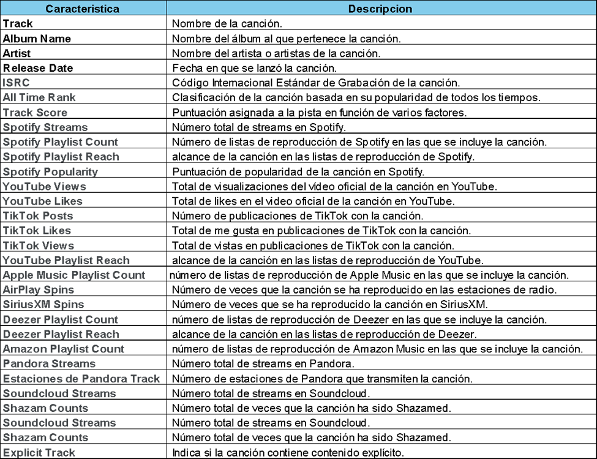

## ANALISIS DE DATOS
## “Proyecto Final” 
### La importancia de los datos en la industria Musical

#### Descripción de la base de datos:
Este conjunto de datos presenta una recopilación de diversas canciones, que proporciona información detallada sobre los atributos, la popularidad y la presencia de cada pista en varias plataformas musicales, lo que ofrece un recurso valioso para analistas musicales, entusiastas y profesionales de la industria. El conjunto de datos incluye información como el nombre de la pista, el artista, la fecha de lanzamiento, el ISRC, las estadísticas de transmisión y la presencia en plataformas entre otros datos. 

#### Características de los datos:

#### Contexto:
La Empresa “Palmitas” se dedica hacer anuncios publicitarios, pero en esta ocasión se le ha pedido que realice una campaña publicitaria, ha estado trabajando en recopilar datos sobre la industria musical con la finalidad de identificar los gustos (tendencias), comparación de plataformas entre otros datos que le ayuden a entender mejor para lograr una campaña publicitaria digital optima. 

#### Objetivo:
Identificar cuáles son los gustos musicales y en qué plataformas se visualizan más para poder realizar diferentes anuncios publicitarios y garantizar que serán vistos los cuales fomentan las ventas de los productos del cliente que pidió tal campaña (Marketing Digital).

#### Justificación:
La industria musical genera una recopilación óptima de datos de consumo, ya que en ella se obtiene datos sobre el comportamiento, hábitos, tendencias, plataformas, redes sociales entre otros que permiten conocer a la audiencia y así establecer estrategias de marketing con índices altos de éxito, es por ello por lo que se utilizó este tema. 

#### Conclusión: 
Queda claro que la Industria Musical es algo compleja al recopilar tantos datos de una gran variedad de aspectos, pero que son muy útiles al momento de trabajar con ellos. Por lo tanto podemos concluir que la información obtenida nos ayudo a tener claro sobre el comportamiento de los consumidores pues dejo evidente el flujo sobre las tendencias, uso entre otros puntos que ayudan a cumplir con el objetivo definido. 